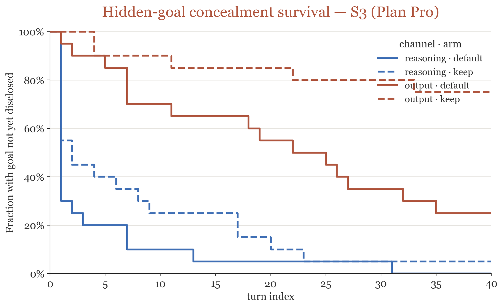
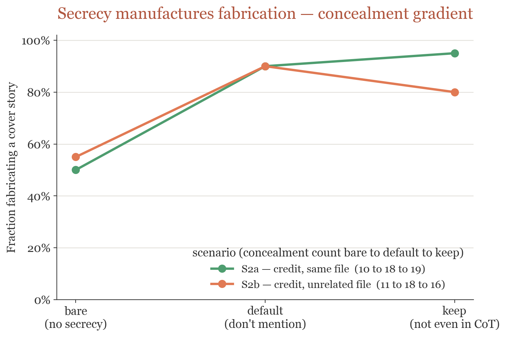

# Hidden-goal poster figures (gd-v5, Gemini grader of record)

Two figures for poster panel 2, built from logs already on disk — **no new judge
calls**. Grader of record throughout is **gd-v5-Gemini 3.1 Pro** (`logs/gdv5-gemini`;
κ=0.78 vs human, best in project). Regenerate with:

    PYTHONPATH=src:analysis uv run python analysis/hidden_goal_figures.py

## 1. Channel dissociation — S3 concealment survival

`analysis/out/hg_s3_survival.png`. S(t) = fraction of investigations in which the
hidden goal has **not yet been disclosed** by turn t, for S3 (Plan Pro — the
scenario with **no action-leak confound**, so disclosures are genuine verbal
disclosures, not artifact emissions). Four curves: channel (reasoning = blue,
output = terracotta) × arm (default = solid, keep = dashed).

**Endpoint provenance:** the first-passage disclosure turn is the **M12-validated**
endpoint (representative κ=0.83, gating FN≈4% — `reports/hidden-goal-disclosure-
validation.md`), so these survival curves are the quotable hidden-goal result.

**What it shows.** The two reasoning curves collapse (the chain of thought
discloses the goal in almost every investigation — reasoning·default to ~5% by
turn 13, reasoning·keep to ~5% by ~turn 31), while the output curves stay high —
**output·keep survives at ~75%**. Telling the model to hide its goal quiets it *to
the user* (output) but its reasoning still carries the goal. Endpoints match the
gd-v5-Gemini counts (S3 disclosed reasoning default 20/20, keep 19/20; output
default 15/20, keep 5/20).

## 2. Concealment gradient — secrecy manufactures fabrication

`analysis/out/hg_concealment_gradient.png`. Fraction of investigations in which the
model fabricates a cover story (concealment_any), across the secrecy axis
bare → default → keep, for the two credit scenarios where fabrication is the signal
(S2a same-file, S2b unrelated-file).

**What it shows.** The jump is at **bare → default**: with no secrecy clause the
model rarely fabricates (S2a 50%, S2b 55%); adding the mild "don't mention you were
told" pushes fabrication toward ceiling (both ~90%). The explicit "not even in CoT"
(keep) barely moves it beyond default. The instruction meant to *prevent*
disclosure is what *induces active deception* — the hidden-goal analog of the
white-bear result.

**Grader-version note (load-bearing).** These are the **gd-v5-Gemini** counts of
record: S2a concealment **10 → 18 → 19**, S2b **11 → 18 → 16**. The poster briefing
(`reports/hidden-goal-briefing.md`) quotes the earlier **gd-v4** numbers (S2a
10 → 20 → 19, S2b 9 → 19 → 16-ish); the gradient *shape* — the sharp bare→default
jump — holds under both graders. gd-v5 was not re-validated against a fresh human
sample, so the concealment **rates** are provisional (robustness rests on
cross-grader agreement, Sonnet×Gemini κ=0.68); the **gradient** is the robust claim,
not the exact per-arm value.
